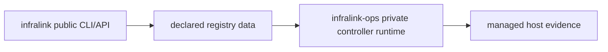

# Infralink

Infralink is a Python library and agent-oriented CLI for modeling infrastructure
topology with UUID-based hosts, typed edges, bounded queries, health checks,
safe connection templates, offline observation contracts, diagrams, generated
documentation, and release evidence inspection.

Current package version: `0.5.8`.

## Start Here

| If you need to... | Start with... |
| --- | --- |
| Understand the public model and repository boundaries | [Architecture](docs/architecture.md) |
| Find the owner for a control-plane task | [Control-plane authority map](docs/control-plane-authority-map.md) |
| Inspect or validate declared infrastructure safely | [Safe CLI workflow](docs/safe-cli-workflow.md) |
| Inspect topology, evidence, or readiness | [Observable model](docs/observable-model.md) |
| Install and use the local diagnostic agent | [Local doctor agent](docs/local-doctor-agent.md) |
| Understand release evidence and adoption | [Release operator workflow](docs/release-operator-workflow.md) |
| Operate a managed host runtime | `cyberstorm-dev/infralink-ops` |
| Select or promote environment desired state | the environment's Registry repository |

Use this repository to model, inspect, validate, and explain infrastructure.
Use the environment controller only through its documented Registry-owned workflow.

## Public Boundary

Infralink is the public CLI, schema, and Python API layer. It models declared
infrastructure data, validates files, emits bounded command envelopes, and
generates documentation or release evidence.

Private host-runtime helpers live in the `cyberstorm-dev/infralink-ops`
consumer repository.
That repo packages controller image primitives such as registry checkout,
template rendering, config projection, BWS-backed secret rendering, image
retention, firewall verification, and the `infralink-host` reconciler timer.



Do not use the public Infralink package as a deployment controller by itself.
It can inspect, validate, and model; environment-specific controllers select
registry revisions and activate services.

## Install

Infralink supports Python 3.10 through 3.12. Artifact-generating commands require POSIX/Linux
filesystem semantics and are validated on Linux in CI.

```bash
python -m pip install infralink
python -m pip install "infralink[bws]"  # optional hosted BWS audit
```

For local development, see [CONTRIBUTING.md](CONTRIBUTING.md). Coding agents
should also read [AGENTS.md](AGENTS.md).

## Public Example

```yaml
# registry.yml
hosts:
  d1b9e5d5-36b0-459d-a556-96622811fbd5:
    canonical_name: database.example.com
    status: active
    group: production
    cloud: example-cloud
    tailscale_ip: 192.0.2.10
    services:
      postgresql:
        port: 5432
        protocol: postgresql
        exposure: internal
```

```yaml
# edges.yml
schema_version: "1.0"
edges:
  - id: 058e29ff-57b9-47c8-b6fa-0914ac03e25c
    type: database
    from:
      hosts: [fa2b9872-d94c-4b20-a73a-57a205560769]
      service: api
    to:
      host: d1b9e5d5-36b0-459d-a556-96622811fbd5
      service: postgresql
      port: 5432
    protocol: postgresql
    auth:
      type: password
      secret_ref: example/database-password
```

Validate and inspect explicit sources:

```bash
infralink --registry registry.yml --edges edges.yml validate
infralink --registry registry.yml --edges edges.yml info
infralink --registry registry.yml --edges edges.yml host show \
  d1b9e5d5-36b0-459d-a556-96622811fbd5
infralink --registry registry.yml --edges edges.yml resolve \
  058e29ff-57b9-47c8-b6fa-0914ac03e25c --user app --database app
```

Resolution returns endpoint metadata, declared secret references, and safe
templates such as:

```text
postgresql://app:${secret:example/database-password}@192.0.2.10:5432/app
```

The CLI never returns resolved secret values and accepts no arbitrary secret
identifier lookup.

## CLI Contract

Every invocation writes exactly one structured envelope to stdout. YAML is the
default for topology and offline observation commands; use `--output json` for
explicit compact JSON. Envelopes include `ok`, a shallow parsed command view, a
typed `result` or redacted `error`, and bounded next actions. Lists use explicit
limits and opaque cursors.

Topology commands use `infralink.cli/v1`. Offline observation commands use
`agent-cli.response.v1`.

## MCP

The same installed executable can serve typed operator tools to an MCP client:

```toml
[mcp_servers.infralink]
command = "/usr/local/bin/infralink"
args = ["mcp", "serve"]

[mcp_servers.infralink.env]
INFRALINK_REGISTRY = "/var/lib/infralink/registry"
```

The server exposes `infralink_command`. Pass an argv array such as
`["doctor", "host", "cyberstorm-watchtower"]`; its structured result is the
same `infralink.cli/v1` envelope returned by the CLI. It accepts no shell
syntax, while existing explicit `--write` and `--apply` gates remain in force.

Useful discovery commands:

```bash
infralink capabilities
infralink help
infralink help resolve
infralink --output json help resolve
infralink explain schema-version-unsupported
```

### Operator Context

For direct operator use, configure one registry checkout root in
`$XDG_CONFIG_HOME/infralink/config.yml` (default:
`~/.config/infralink/config.yml`):

```yaml
registry: /srv/infra-registry
```

The checkout must contain `hosts/`. With that one local selector, Doctor
derives the standard edges and observation inputs from the checkout and keeps
their resolved paths in its response:

```bash
infralink doctor host relayos-staging
```

Explicit `--registry`, `INFRALINK_REGISTRY`, and per-source flags override the
local config. Gatus URL and token remain process configuration, so an MCP may
set `INFRALINK_REGISTRY` and its Gatus environment without duplicating CLI
logic. The local config never selects a registry revision or desired state.

Offline observation examples:

```bash
AS_OF=2026-08-17T00:00:00Z
infralink validate --source examples/observation --as-of "$AS_OF"
infralink project observation --source examples/observation --as-of "$AS_OF"
infralink project secrets --source examples/observation --as-of "$AS_OF"
infralink project view service-overview --source examples/observation --as-of "$AS_OF"
infralink project readiness ci-release --source examples/observation --as-of "$AS_OF"
```

Observation documents declare `schema_version: infralink.observation/v1` and may
be validated against packaged schemas under
`src/infralink/schemas/observation/v1` and
`src/infralink/schemas/observation/v2`.

In v2, a service profile may declare `configuration_slots` for non-secret
render or materialization inputs. A slot is profile-wide by default and may
optionally name a component owner. Instances supply exactly one typed
`configuration_binding` for each required slot. Supported values are strings,
integers, booleans, string lists, records, and record lists with explicitly
declared fields; record fields are limited to scalars and string lists. The
cross-document loader validates the binding against the profile contract, and
`plan_v2_configuration_bindings()` returns the normalized, deterministically
ordered renderer input. Secrets continue to use `resource_slots` and secret
references rather than configuration bindings.

## Exit Codes

| Code | Meaning |
| --- | --- |
| `0` | Positive domain result |
| `1` | Completed negative domain result |
| `2` | Usage error |
| `3` | Input, schema, or entity error |
| `4` | Provider or authentication failure |
| `69` | Unsupported platform |
| `70` | Unexpected internal failure |
| `74` | Artifact I/O failure or retained recovery state |

Exit `74` uses `artifact_io_failed` for storage failures and
`artifact_recovery_required` when recovery state is retained. `internal_error`
is reserved for exit `70`.

## Python API

```python
from infralink import EdgeResolver, EdgeSet, Registry

registry = Registry.load("registry.yml")
edges = EdgeSet.load("edges.yml")
resolver = EdgeResolver(registry, edges)

endpoint = resolver.get_target_endpoint("058e29ff-57b9-47c8-b6fa-0914ac03e25c")
template = resolver.get_connection_template(
    "058e29ff-57b9-47c8-b6fa-0914ac03e25c",
    user="app",
    database="app",
)
```

Legacy Python URL helpers remain available for compatibility but are
deprecated. New integrations should use secret references and connection
templates.

## Development And Operations

- Contribution flow and canonical checks: [CONTRIBUTING.md](CONTRIBUTING.md)
- Agent instructions: [AGENTS.md](AGENTS.md)
- Architecture/navigation: [docs/architecture.md](docs/architecture.md)
- Public/private runtime split: [docs/architecture.md#public-and-private-runtime-boundary](docs/architecture.md#public-and-private-runtime-boundary)
- Observable topology and metric contracts: [docs/observable-model.md](docs/observable-model.md)
- Security boundaries: [docs/security-boundaries.md](docs/security-boundaries.md)
- Release workflow: [docs/release-operator-workflow.md](docs/release-operator-workflow.md)
- v0.2 migration history: [docs/compatibility/v0.2.md](docs/compatibility/v0.2.md)
- Current and historical release notes: [docs/releases/](docs/releases/)

## Release Adoption And Rollback

Woodpecker is the only CI release executor. The manual release step runs only
for `main` on Python 3.12 after all three parallel Python-version quality gates.
It requires `RELEASE_VERSION` to match the package version and the pipeline
commit to equal the current `main` commit. It rebuilds and publishes exactly the
wheel, sdist, `SHA256SUMS`, and `SHA256SUMS.sigstore.json` to the matching
GitHub Release tag. Existing tags or releases stop the process for operator
inspection.

Consumers verify the Cosign bundle and `SHA256SUMS` before installing the
wheel, then record the source commit and wheel digest in consumer configuration.
Rollback restores the previously verified release revision and digest; it does
not rebuild old source or mutate the existing public release.

Managed-host adoption is a consumer workflow. For private host controller
runtime, adopt the verified wheel into the `infralink-ops` consumer repository,
publish the controller image there, and select that image through the
environment registry.

## License

MIT
