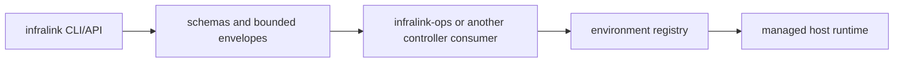

# Architecture

Infralink is organized around explicit, file-backed infrastructure facts and
bounded command outputs. It does not discover live infrastructure by default and
does not make private provider data public.

## Public And Private Runtime Boundary

This repository is the public package boundary. It owns the CLI/API contracts,
schemas, examples, release artifacts, and provider-neutral models.

Private host-controller packaging belongs to the `cyberstorm-dev/infralink-ops`
consumer repository.
That consumer packages controller images and host launchers for registry
checkout, rendering, config projection, BWS-backed secret rendering, Docker
image retention, firewall verification, and host doctor evidence.



The public package may validate registry data or produce operation requests. It
does not choose a registry revision, publish controller images, resolve private
tenant policy, or activate services on a host.

## Package Map

- `src/infralink/cli/main.py` owns the root Click command tree, lazy command
  loading, help metadata, parsed command context, and shared envelope emission.
- `src/infralink/cli/contracts.py`, `observation_contracts.py`, and
  `operation_contracts.py` define typed CLI result models used by schema
  generation and tests.
- `src/infralink/core/registry.py`, `edges.py`, and `resolver.py` load declared
  host/service topology, validate typed edges, and resolve safe endpoints.
- `src/infralink/core/template.py` and `src/infralink/secrets/` keep connection
  output at the secret-reference boundary.
- `src/infralink/observation/` loads offline observation documents, canonicalizes
  service/profile/dependency/view data, explains diagnostics, and plans
  readiness or operations views.
- `src/infralink/cli/host_readiness.py`, `host_transport.py`, and
  `host_registry_state.py` support host bootstrap/apply planning and bounded
  operation status.
- `src/infralink/release/contracts.py` defines release candidate, publisher
  request, and attestation contracts for local validation and inspection.
- `src/infralink/generators/` renders deterministic diagram and documentation
  artifacts.

## Data Flow

Topology commands load explicit registry and edge sources from `--registry`,
`--edges`, `INFRALINK_REGISTRY`, and `INFRALINK_EDGES`. Direct operator use may
select one registry checkout root with `registry:` in
`$XDG_CONFIG_HOME/infralink/config.yml`; this selector derives standard
checkout-relative Doctor inputs but never selects a registry revision or
desired state. Examples under `examples/` are demo and test inputs only; they
are not implicit operational fallbacks.

`analyze` specifically requires that checkout root. It does not accept a
standalone YAML topology or `hosts/` as a compatibility selector, so its
generated artifacts and continuation actions always retain one canonical source.

Each CLI invocation emits one structured envelope. Topology commands use
`infralink.cli/v1`; offline observation commands use `agent-cli.response.v1`.
Both include parsed command metadata, bounded results or redacted errors, and
limited next actions.

## MCP Transport

`infralink-mcp` is the native stdio Model Context Protocol transport. It does
not serialize CLI output as MCP: MCP owns its JSON-RPC handshake and tool
discovery. Every MCP tool is the native projection of the same registered
Pydantic operation that generates the `infralink` CLI. There is no generic argv
bridge and no shell interpretation.

The MCP transport exposes the existing operator surface, including explicit
registry authoring writes. It does not add generic shell execution, a second
desired-state selector, or an alternate deployment path. Existing `--write` and
`--apply` gates remain in the CLI implementation.

Installed operation packages extend this same surface through a build-generated
Agent Surface manifest in their wheel. Root help and native MCP enumerate that
manifest without importing the package; an explicit command invocation imports
the selected app and verifies that it exactly matches the manifest before it
runs. This keeps CLI help, native MCP schemas, and executable operations on one
typed contract without discovery-time controller side effects.

For Codex, configure the native executable and the registry checkout root:

```toml
[mcp_servers.infralink]
command = "/usr/local/bin/infralink-mcp"

[mcp_servers.infralink.env]
INFRALINK_REGISTRY = "/var/lib/infralink/registry"
```

Generated artifacts are written to explicit output directories and represented
on stdout by bounded artifact metadata. Transactional artifact commands are
currently POSIX/Linux-oriented because they depend on filesystem semantics that
are tested in CI.

## Schemas

Packaged schemas live under `src/infralink/schemas/` and are generated from
typed models:

- CLI schemas: `scripts/generate_cli_schemas.py`
- observation schemas: `scripts/generate_observation_schemas.py`
- release schemas: `scripts/generate_release_schemas.py`

The quality pipeline runs generation and then `git diff --exit-code` so model
and schema drift fails fast.

## CI Fast Path

Changes limited to the documentation contract inputs (`README.md`, `docs/**`,
`tests/test_docs_contract.py`, and `.woodpecker.yml`) select Woodpecker's
`docs-contract` step. It runs the documentation contract test and regenerates
the CLI, observation, and release schemas before requiring a clean diff. A
change outside those inputs uses the full Python 3.12 quality gate. This keeps
documentation feedback fast without allowing generated schemas to drift.

## Tests

The `tests/` tree covers command contracts, schema generation, public data
boundaries, host operations, release policy, Woodpecker policy, and domain
logic. Policy tests intentionally inspect configuration files such as
`.woodpecker.yml`; update those tests when changing CI or release commands.

## Release Tooling

Woodpecker runs the Python 3.12 quality gate. Its release job is manual, `main`-only,
and depends on that quality gate. Local release helper
scripts validate versions, exact protected-main commits, toolchain checksums,
asset names, checksums, and release attestations. They do not replace the
protected Woodpecker release step.

## More Context

- Control-plane ownership and migration path: [Control-plane authority map](control-plane-authority-map.md)
- Observable topology, resources, metrics, and readiness rollups:
  [Observable model](observable-model.md)
- Private controller runtime consumer: `cyberstorm-dev/infralink-ops`
- Setup and PR flow: [CONTRIBUTING.md](../CONTRIBUTING.md)
- Security boundaries: [docs/security-boundaries.md](security-boundaries.md)
- v0.2 migration history: [docs/compatibility/v0.2.md](compatibility/v0.2.md)
- Release operator workflow: [docs/release-operator-workflow.md](release-operator-workflow.md)
