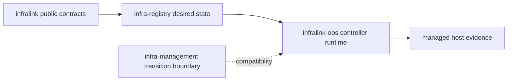

# Control-Plane Authority Map

## BLUF

Use this page to identify the owner for a control-plane task before changing
code or configuration. `cyberstorm-dev/infralink` owns public contracts;
`cyberstorm-dev/infralink-ops` owns the installed controller runtime;
`relaxgg/infra-registry` owns environment desired state; and
`relax-dot-gg/infra-management` is the transition boundary for legacy runtime
concerns. Registry is the sole desired-state authority.

This is a map, not a runbook. Follow the linked owner documentation for an
operator procedure; do not copy a runbook into this page.

## Authority At A Glance

| Repository | Owns | Does not own | Start here |
| --- | --- | --- | --- |
| [`cyberstorm-dev/infralink`](https://github.com/cyberstorm-dev/infralink) | Public CLI, Python API, schemas, provider-neutral topology and release-evidence contracts | Environment selection, secret resolution, host activation | This repository's [architecture](architecture.md) |
| [`cyberstorm-dev/infralink-ops`](https://github.com/cyberstorm-dev/infralink-ops) | Installed controller image and operator-facing `infralink` runtime commands | Public schema/API compatibility and Registry intent | Its operator runbooks and controller runtime reference |
| [`relaxgg/infra-registry`](https://gitea.i.cyberstorm.dev/relaxgg/infra-registry) | Declared environment topology, profiles, templates, image selections, and promotion inputs | Controller implementation and host-local credential resolution | Its desired-state and promotion documentation |
| [`relax-dot-gg/infra-management`](https://github.com/relax-dot-gg/infra-management) | Compatibility and migration work while legacy consumers remain | A new independent desired-state model | Its transition-boundary documentation |

## Supported Operator Path

1. Change environment intent in the applicable Registry repository.
2. Use the Registry's promotion and validation process to select the reviewed
   immutable input.
3. Let the installed `infralink-ops` controller reconcile that input on the
   target host and inspect its evidence through the documented operator CLI.
4. Use public `infralink` locally to inspect or validate contracts without
   gaining deployment authority.

The controller consumes a reviewed Registry state. It must not become a second
place to define host topology, service image choices, or tenant policy.

## Migration Boundary

`infra-management` remains relevant only where an existing host or automation
path still depends on its compatibility behavior. New generic controller
runtime work belongs in `infralink-ops`; new environment declarations belong in
`infra-registry`; and public portable contracts belong in `infralink`.

When a task spans this boundary, preserve a single authoritative input and make
the compatibility relationship explicit in the issue and review. Do not add a
parallel deployment path merely to avoid a migration.

## Fast Routing

| If the task is... | Use... |
| --- | --- |
| A public command, schema, envelope, or provider-neutral model change | `infralink` |
| An installed CLI, controller image, reconciliation action, or host evidence question | `infralink-ops` |
| A host, profile, template, image selection, promotion, or desired-state change | `infra-registry` |
| A temporary legacy compatibility or migration concern | `infra-management` |

If the task changes more than one row, create linked issues and state which
repository owns each contract. The authority map avoids bucket-brigade changes;
it does not erase the need for separate reviews where contracts cross a
repository boundary.
