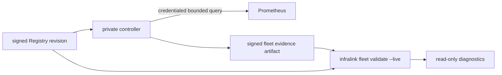

# Fleet Prometheus Evidence Design

**Tracking:** `cyberstorm-dev/infralink#306`, `#296`; migration target `relax-dot-gg/infra-management#728`.

## BLUF

`infralink fleet validate --live` must not become a second Prometheus client.
The private controller owns credentialed Prometheus access and periodically
materializes a bounded, signed evidence artifact. The public Infralink CLI/MCP
operation reads that artifact only through its configured local observation
source, joins it to the selected Registry revision, and reports stale, missing,
or failed recent-sample evidence as normal fleet diagnostics.

This replaces the useful result of `scripts/prometheus_qa.py` while removing its
unsafe interfaces: no environment credentials, no username/password options,
no Prometheus URL option, and no parsing of a checked-in Prometheus scrape file.

## Authority Split



| Component | Authority | Explicitly not allowed |
| --- | --- | --- |
| Registry | Declares expected observable targets and revision identity. | Credentials, live result mutation. |
| Private controller | Resolves the declared Prometheus binding, queries bounded recent samples, writes/signs evidence. | Public CLI/MCP projection. |
| Infralink public CLI/MCP | Validates the evidence artifact against the selected Registry and reports facts. | Network, BWS, environment credential, host, Docker, SSH, DB, render, reload, or reconcile access. |

## Evidence Contract

The controller artifact is `infralink.fleet-prometheus-evidence/v1`. It is
stored outside the Registry checkout in a protected controller/runtime state
directory selected by operator configuration, never by a command-line path.

```yaml
schema_version: infralink.fleet-prometheus-evidence/v1
registry_revision: 40-64 lowercase hex source revision
generated_at: RFC3339 UTC timestamp
window_seconds: 600
targets:
  - id: stable registry-derived target ID
    status: observed | absent | query_error
    observed_at: RFC3339 UTC timestamp or null
    detail_code: bounded stable code
signature:
  key_id: declared signing-key identity
  algorithm: ed25519
  value: base64 signature
```

The target ID is derived by the controller from declared Registry observation
targets. It is not a Prometheus `job`/`instance` string and cannot contain
credentials or arbitrary labels. The artifact contains no query expressions,
Prometheus URL, response body, bearer token, Basic-auth header, or secret
reference. `detail_code` is from a fixed enum such as `sample_missing`,
`query_timeout`, and `provider_unavailable`.

The controller must atomically replace the entire artifact only after all
bounded target queries complete. A failed refresh retains the last valid
artifact and separately exposes freshness failure; it must not write a partial
success document.

## Public Command Behavior

- Static `infralink fleet validate` remains entirely hermetic.
- `--live` requires an operator-configured evidence directory and exactly one
  evidence artifact for the selected Registry revision.
- The command verifies schema, bounded target IDs, timestamp freshness,
  revision identity, and signature before interpreting statuses.
- Missing configured evidence, stale evidence, wrong revision, invalid
  signature, incomplete target coverage, and provider-reported failures yield
  completed negative diagnostics. They never trigger a query or repair.
- The normal result retains `mode: live`; the report identifies an evidence
  state rather than a fabricated live probe.

## Sequencing

1. Add the typed evidence schema/parser and `FleetEvidenceRequest` source
   selected only by operator configuration. Publish the read-only parsing and
   negative-result contract in Infralink.
2. Add the controller producer in `infralink-ops`, including its credential
   binding, bounded query policy, signing, atomic write, and timer health.
3. Add an Infra Registry declaration for observable Prometheus targets and the
   controller binding. Do not reuse legacy `monitoring/prometheus/prometheus.yml`.
4. Add integration fixtures proving controller-produced valid, stale,
   wrong-revision, and provider-failure evidence flows through `fleet validate
   --live` with no public-network access.
5. Switch the periodic audit runner and docs, then delete `prometheus_qa.py`
   under the existing infra-management issue.

## Non-Goals

- Direct Prometheus HTTP access from `infralink`.
- CLI/MCP secret, URL, target-file, credential, certificate, or query options.
- A generic evidence plugin API or arbitrary artifact path.
- A controller reconcile, restart, reload, or alert acknowledgement action.
