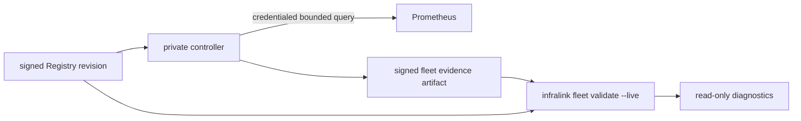

# Fleet Prometheus Evidence Design

**Tracking:** `cyberstorm-dev/infralink#306`, `#296`; migration target `relax-dot-gg/infra-management#728`.

## BLUF

`infralink fleet validate --live` must not become a second Prometheus client.
The private controller owns credentialed Prometheus access and periodically
materializes a bounded, signed evidence artifact. The public Infralink CLI/MCP
operation reads that artifact only through its configured local observation
source, joins it to the selected Registry revision, and reports stale, missing,
or failed recent-sample evidence as normal fleet diagnostics.

This replaces the useful result of `scripts/prometheus_qa.py` while removing its
unsafe interfaces: no environment credentials, no username/password options,
no Prometheus URL option, and no parsing of a checked-in Prometheus scrape file.

## Authority Split



| Component | Authority | Explicitly not allowed |
| --- | --- | --- |
| Registry | Declares expected observable targets and revision identity. | Credentials, live result mutation. |
| Private controller | Resolves the declared Prometheus binding, queries bounded recent samples, writes/signs evidence. | Public CLI/MCP projection. |
| Infralink public CLI/MCP | Validates the evidence artifact against the selected Registry and reports facts. | Network, BWS, environment credential, host, Docker, SSH, DB, render, reload, or reconcile access. |

## Evidence Contract

The controller artifact is `infralink.fleet-prometheus-evidence/v1`. It is
stored outside the Registry checkout in a protected controller/runtime state
directory selected by operator configuration, never by a command-line path.

```yaml
schema_version: infralink.fleet-prometheus-evidence/v1
registry_revision: 40- or 64-character lowercase hex source revision
generated_at: RFC3339 UTC timestamp
window_seconds: integer from 1 through 3600
max_age_seconds: integer from 1 through 3600
targets:
  stable-registry-derived-target-id:
    id: same stable registry-derived target ID
    status: observed | absent | query_error
    observed_at: RFC3339 UTC timestamp or null
    detail_code: sample_observed | sample_missing | provider_unavailable | query_timeout | query_failed
signature:
  key_id: declared signing-key identity
  algorithm: ed25519
  value: base64-encoded 64-byte signature
```

The target ID is derived by the controller from declared Registry observation
targets. It is not a Prometheus `job`/`instance` string and cannot contain
credentials or arbitrary labels. The artifact contains no query expressions,
Prometheus URL, response body, bearer token, Basic-auth header, or secret
reference. `detail_code` is from a fixed enum such as `sample_missing`,
`query_timeout`, and `provider_unavailable`.

The controller must atomically replace the entire artifact only after all
bounded target queries complete. A failed refresh retains the last valid
artifact and separately exposes freshness failure; it must not write a partial
success document.

### Shared Contract Source

The contract is published by the `infralink` library, not by a separate
runnable or a copied schema. Its release contains all of:

- a strict Pydantic model used by the controller producer and later reader;
- `infralink/schemas/fleet/prometheus-evidence-v1.json` for non-Python
  validation; and
- a valid signed fixture plus a canonical unsigned payload fixture.

The signature covers the complete document except `signature.value`. The
canonical payload is UTF-8 `json.dumps` output with `sort_keys=True`,
`ensure_ascii=True`, and `separators=(",", ":")`; there is no trailing newline.
`signature.key_id` and `signature.algorithm` remain inside the signed payload.
All timestamps use exactly `YYYY-MM-DDTHH:MM:SSZ`; fractional seconds and UTC
offset variants are invalid. Target IDs are unique map keys, lowercase
identifiers matching `[a-z][a-z0-9-]{0,127}`, and must equal the nested `id`.
`observed` requires `sample_observed` and a non-null `observed_at`; `absent`
requires `sample_missing` and a null `observed_at`; `query_error` requires null
`observed_at` and one of the three query/provider failure detail codes. An
observed sample must not be future-dated and must fall inside `window_seconds`
relative to `generated_at`. The reader rejects any artifact older than signed
`max_age_seconds`, subject only to its documented bounded clock-skew allowance.
These constraints prevent a successful-looking partial or stale artifact.

The Registry declares the expected `key_id` indirectly through its opaque
controller signing binding reference. The controller resolves the private key;
the public reader resolves that key ID against an operator-configured trusted
public-key map. The map is not a CLI argument, secret, or Registry field.
Rotation adds the new public key before Registry and controller move to its new
key ID; revocation removes the old mapping and advances the Registry reference.

## Public Command Behavior

- Static `infralink fleet validate` remains entirely hermetic.
- `--live` requires an operator-configured evidence directory and exactly one
  evidence artifact for the selected Registry revision.
- The command verifies schema, bounded target IDs, timestamp freshness,
  revision identity, and signature before interpreting statuses.
- Missing configured evidence, stale evidence, wrong revision, invalid
  signature, incomplete target coverage, and provider-reported failures yield
  completed negative diagnostics. They never trigger a query or repair.
- The normal result retains `mode: live`; the report identifies an evidence
  state rather than a fabricated live probe.

## Sequencing

1. Publish and test the typed evidence schema, canonical signing payload, and
   real Ed25519 verification fixture in the Infralink library. This adds no
   command, MCP operation, or configured artifact reader.
2. In parallel, add the controller producer in `infralink-ops`, including its
   credential binding, bounded query policy, signing, atomic write, and timer
   health, and add the Infra Registry declaration for observable Prometheus
   targets and controller binding references. Do not reuse legacy
   `monitoring/prometheus/prometheus.yml`.
3. Add the Infralink `--live` reader only after the artifact shape is stable.
   Its source is selected only by operator configuration.
4. Add integration fixtures proving controller-produced valid, stale,
   wrong-revision, and provider-failure evidence flows through `fleet validate
   --live` with no public-network access.
5. Switch the periodic audit runner and docs, then delete both
   `prometheus_qa.py` and `check_prom_freshness.py` under their existing
   infra-management issues.

## Non-Goals

- Direct Prometheus HTTP access from `infralink`.
- CLI/MCP secret, URL, target-file, credential, certificate, or query options.
- A generic evidence plugin API or arbitrary artifact path.
- A controller reconcile, restart, reload, or alert acknowledgement action.
